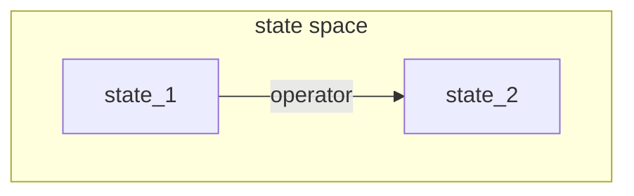

## Lecture 1

### homework

- [x] 1000 字 AI 對生活影響和作用
- ./AI.md

## Lecture 2

search

state machine:

- state
- state space
- operator

search:

1. BFS.DFS
2. inspire function:according to the prosperity of target, check when search
   - 目的驅動
   - 數據驅動
   - 雙向搜索

弱法:難以克服組合爆炸
生成測試法:

## Lecture 3

- Generate and test:

1. generate a possible test
2. compare test to goal
3. stop or to step 1

(dfs)

- Hill-climbing

1. generate and test
2. according to test, generate a test group
3. compare test in group to goal
4. select the best test(in current or history group), ro do 2

random search:

- group search

graph search:
A & A\* algorism

## Lecture 4

AO\* algorithm

## Lecture N\A

3.3 5.1 6.5 7.2
