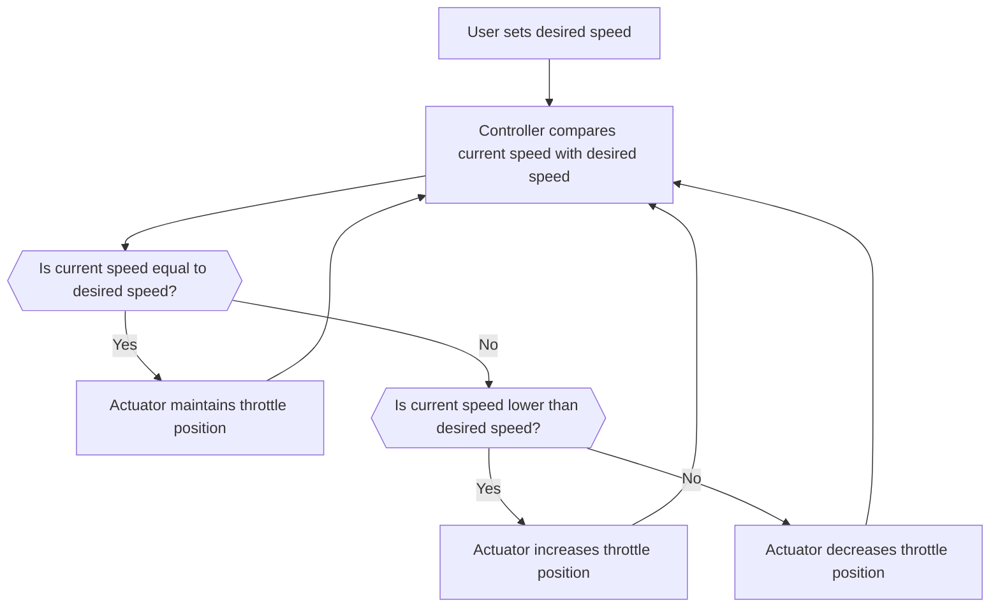
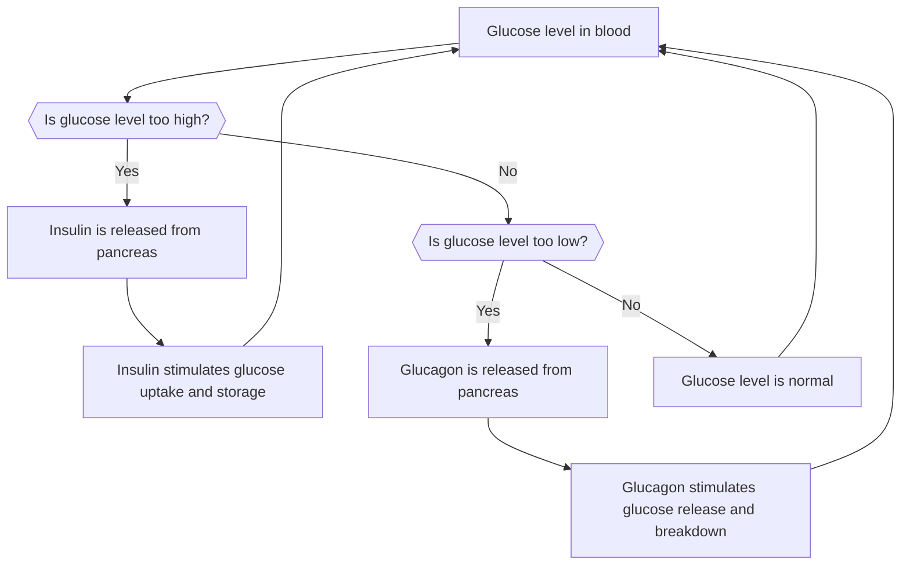
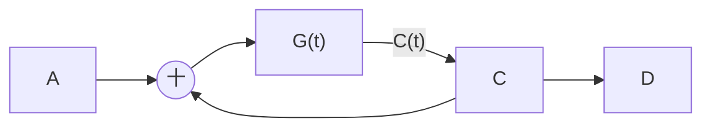
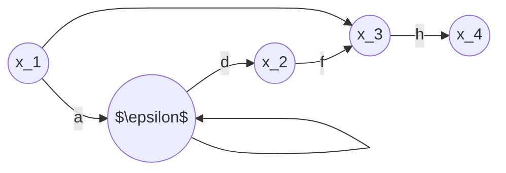

## Lecture 1

NULL

## Lecture 2

### homework

- [x] 舉兩個控制系統實例並說明其工作原理

### Cruise control

Cru#se control is a system that automatically controls the speed of an automobile. The system is a servomechanism that takes over the throttle of the car to maintain a steady speed as set by the driver.

##### How it works

Cruise control systems usually consist of four main components: a speed sensor, a controller, an actuator, and a user interface.

- The speed sensor measures the current speed of the vehicle and sends the information to the controller.
- The controller compares the current speed with the desired speed and
  calculates the amount of throttle needed to maintain or adjust the
  speed.
- The actuator controls the throttle valve and adjusts the amount of air and fuel entering the engine.
- The user interface allows the driver to set, adjust, resume, or cancel the cruise control system. It is usually located on or near the steering wheel.

##### Mermaid code example

Here is an example of how to use mermaid code to create a flowchart that illustrates the basic logic of cruise control:

##### Conclusion

Cruise control is a useful feature that can make driving more
comfortable and efficient. It works by using a servomechanism to control
the throttle of the car based on the desired speed set by the driver.
Mermaid code is a simple way to create diagrams from text that can help
explain how cruise control works.

### Blood glucose regulator

Blood glucose regulator is a system that maintains the concentration of glucose in the blood within a narrow range. Glucose is the main source of energy for the cells of the body, and its level in the blood is affected by various factors, such as food intake, physical activity, stress, and hormones1.

##### How it works

Blood glucose regulator involves the action of two hormones: insulin and glucagon. These hormones are produced by the pancreas and act on the liver and other tissues2.

- Insulin is released when there is a high concentration of glucose in the blood, such as after a meal. Insulin stimulates the uptake of glucose by the cells, especially the muscle and fat cells, and inhibits the production of glucose by the liver. Insulin also promotes the storage of glucose as glycogen in the liver and muscles, and as triglycerides in the fat cells3.
- Glucagon is released when there is a low concentration of glucose in the blood, such as during fasting or exercise. Glucagon stimulates the breakdown of glycogen to glucose in the liver, and the release of glucose into the blood. Glucagon also promotes the breakdown of triglycerides to fatty acids and glycerol, which can be used as alternative sources of energy by some tissues4.

##### Mermaid code example

Here is an example of how to use mermaid code to create a flowchart that illustrates the basic logic of blood glucose regulator:

##### Conclusion

Blood glucose regulator is a vital system that ensures the balance of glucose in the blood for optimal cellular function. It works by using insulin and glucagon as feedback mechanisms to adjust the glucose level according to the body’s needs. Mermaid code is a simple way to create diagrams from text that can help explain how blood glucose

## Lecture 3

use function to describe control system

signal function

many different signal functions:

阶跃输入是变化最剧烈,对系统最不利的外作用.若系统可以在阶跃函数下完成任务,那其他作用也可以满足(极限测试)

好的系统:稳(过渡过程的收敛情况斜率很大),准(过渡过程结束后稳态误差越小越好),快(过渡过程进行的时间越小越好)

数学建模,然后可以展开对控制系统的研究

:fourier 变换与 laplace 变换,时域模型,复数域模型,结构图与信号流图

一般都是用查表求 laplace 變換與逆變換

## Lecture 4

### Classic problem

1. differential equation:(liner)

- define `input`
- combine all equations into one `standard equation`:
  - F(t)=output=f(input)
  - like y=f(x)
  - prosperity:differential times from top to down, left to right

2. Laplace transform

- why laplace transform could trans time?
  - it can't, but just a way to handle ODE, trans calculus to algebra
- inverse to original function(look at table)

3. linear non-linear function

- ignore nonlinear part
- Taylor expand (in Operation Point)and take low exponent items(linear approach)

### Transfer function

prerequisites:$\exists\mathcal{L}\{y(t)\}=\mathcal{L_y}(s)$ , $\mathcal{L}\{x(t)\}=\mathcal{L_x}(s)$
define:$H(s)=\frac{Y(s)}{X(s)}=\frac{\mathcal{L}\{y(t)\}}{\mathcal{L}\{x(t)\}}$
aka:$Y(s)=H(s)X(s)$(一般是开环传递函数)
aka:$C(s)=G(s)R(s)$
aka:$\mathcal{L_y}(s)=H(s)\mathcal{L_x}(s)$
$X(s)$,称为特征方程或者模态,决定系统的运动形式和稳定性
:只有实根(e.g.$e^{-at}$)则不会振荡,有虚根(e.g.$e^{-at}\sin(\omega t)$)则会振荡

## Lecture 5

特点:

- 在电路里可以成为动态增益,可以随变化而变化
- 与微分方程一一对应
- 表示动态特性,与输入输出条件无关
- 静态增益==稳态增益
- 只能描述线性定常系统和单输入单输出系统
- 只能反映零初始条件下(稳态初始条件)的动态变化
- 不提供有关系统物理结构的任何信息

非零初始条件:~~解微分方程~~

- 求关于 C(t)R(t)的微分方程(e.g.$(s^2+3s+2)C(s)=C''+3C'+2C$)
- 带入求解
- 换回微分方程

方框图/结构图:

1. 用各时间域中变量用拉氏变化后的$X(t)/R(t)$表示
2. 将各元件名称换成各元件的传递函数

structure graph conclusion:

- is math model, not response for physical details
- 更直观
- 单向不可逆
- 不唯一,依传递函数列而变
- 研究方便

# Lecture 6

信号流图:和结构图一样,是控制系统中个变量间数学关系的一种图解表示法:方便求出系统传递函数

组成:节点;支路

前向通道:从原点开始,到阱节点,与任何节点相交不超过一次
前向通道增益:通道上各增益的乘积
类似的:
回路:起始节点相同,与其他节点增益不超过一次
互不接触回路:除起始点,没有相同节点的回路
回路增益:回路上各增益的乘积

**梅森增益公式**

$G(s)=\frac{y_{out}}{y_{in}}=\frac{1}{\Delta}\sum_{k=1}^{n}P_K\Delta_K$
n 为前向通道数
$P_k$ 为第 k 条前向通道增益
$\Delta_K$为与前向通道互不接触回路增益

homework:2-2;2-6;2-10;2-11

线性系统:齐次型的叠加性

动态性能指标:

- 上升时间 t_r
- 峰值时间
- 稳定时间
- 超调量
- 振荡次数

## Lecture N/A

Chapter3--Problem:2 5 6 7 11 12 13 14 17 19
