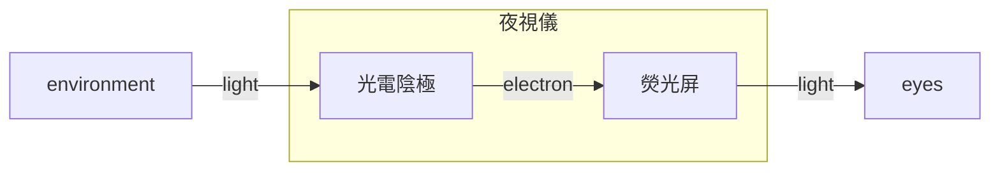

## Lecture 1

Definition of detection and identification technology:
_A non-contact measurement to a fixed or moving target. The measured signals contain distance, position, azimuth or height information, etc, which can be used to determine the target's position, speed, attitude, etc._

Three attacks:

1. Attack Gunship(helicopter)
2. Attack a cruise missile
3. Attack Stealth aircraft

Three defenses:

1. Air surveillance defense,
2. Electronic interference defense
3. Precision strike defense(Surgical  strike defense)

Information superiority:

1. Obtain our and enemy’s real-time or quasi real-time effective information through various means
2. Make sure that our messages are not taken by the enemy
3. Destroy enemy information transfer channels

## Lecture 2

development of low-level-light night vision:

- 1936, P.Gorlich invented photocathode(Sb-Cs)
- 1958, Campani invented High Resolution optic Fiber Faceplate
- 1962, US invented Three Level Cascade Image Intensifier--1st Generation of LLL Night Vision which used in Vietnam war
- 1970, Micro Channel Plate (MCP) Image Intensifier was invented--2nd Generation of LLL Night Vision which used in Falkland war
- 1979, ITT company invented an image Intensifier tech which using Negative Electron (GaAs) Affinity Photocathode and MCP--3rd Generation of LLL Night Vision

thermal imaging technology

- in nature, all objects will radiate infrared radiation
- detectors are used to measure the difference between the target and the background of the infrared ray can help us get different infrared images called thermal images.
- the thermal image reflects the surface temperature

sensors

## Lecture 4

- synthetic aperture radar:synthetic aperture radar along the long term is to use a small antenna array the trajectory of constant speed mobile and radiation coherent signals, the coherent processing the received echo in different position can achieve the high resolution imaging

synthetic 合成;aperture 光圈,孔穴;trajectory 迹线;coherent 相干;echo 回波;resolution 消解,解析

- Imaging Geometry
  - Azimuth:Azimuth refers o the along-track dimension parallel to the flight direction
  - swath width:swath width refers to the strip of the earth's surface from which data are collected by a side-looking airborne radar(SLAR)
    azimuth:方位;dimension:大小;swath 扫描;strip 带(宽)

## Lecture 5

Visual perception characteristics of human eyes:

- the eye is a complex optical instrument consisting of several parts
- The CORNEA is exposed to the outside environment and therefore must repair itself rapidly because it is constantly faced with abrasion
- it is transparent to all visible and near infrared wavelengths. the pupil is the opening that allows light into the eye.its size is controlled by light sensitive iris

## Lecture unknown

kirchhoff's law of thermal radiation

the radio of its emissive power to its dimensionless coefficient abortion

## experiment before 17 week

## Lecture 24/10

Joule-kelvin effect kelvin-joule effect and joule-thomson expansion

1. compression is performed in a compression chamber
2. release compression heat
3. the stored cold is absorbed in the regenerator inside the expansion piston
4. expansion cooling in expansion chamber
5. pass cool amount to regenerator
